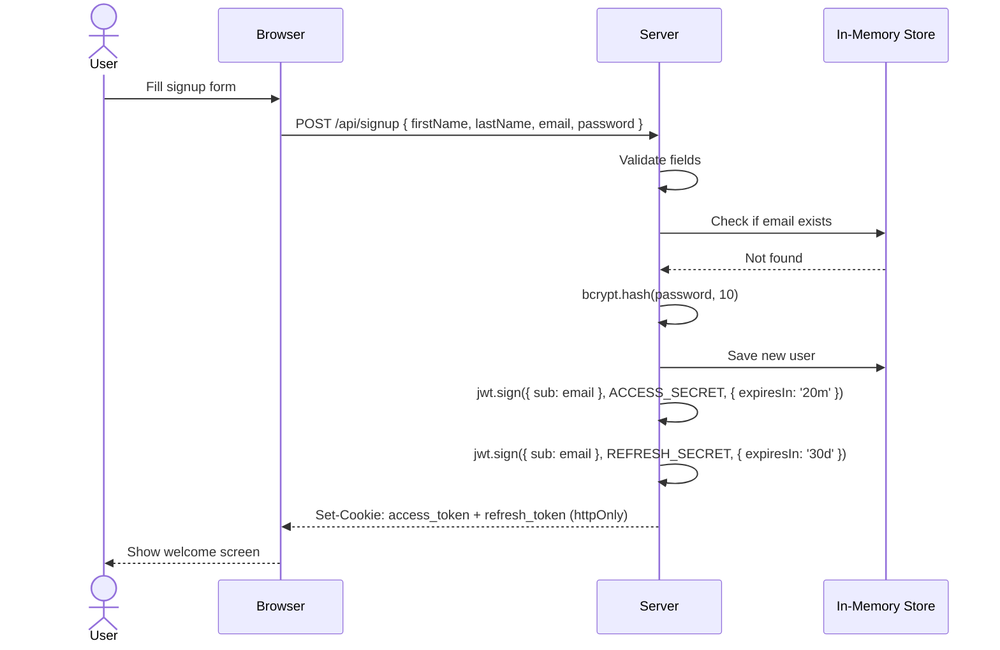
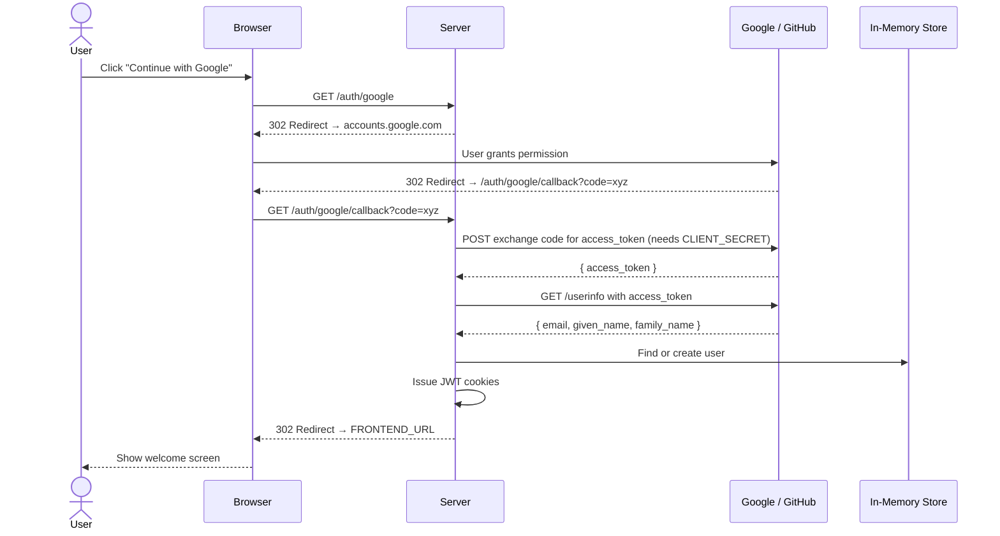
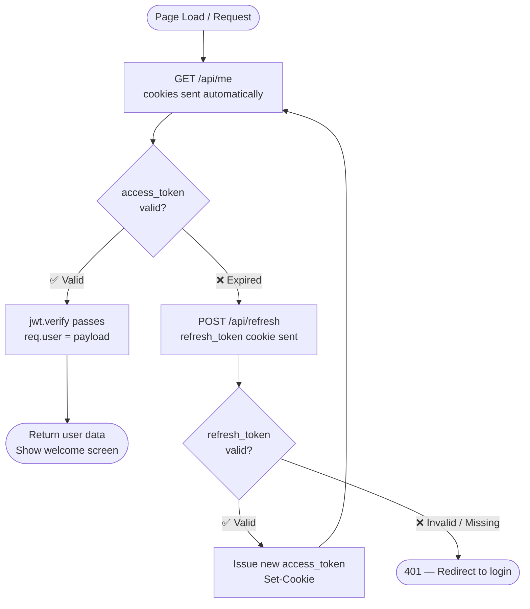
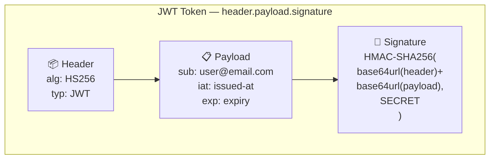
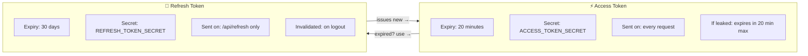

<div align="center">

# 🔐 JWT Concept

### A production-style authentication system built to make JWT, OAuth 2.0, and secure session management fully transparent.

[](https://jwt-concept.vercel.app/)
[](https://nodejs.org/)
[](https://expressjs.com/)
[](https://vercel.com/)
[](LICENSE)

<br/>


> **Try it live →** [jwt-concept.vercel.app](https://jwt-concept.vercel.app/)

</div>

---

## 📌 What is this?

**JWT Concept** is a fully working auth system built from scratch — no Passport.js, no Auth0, no magic. Every step of the authentication pipeline is hand-written and documented so you can see exactly what's happening.

It implements:

- ✅ Email + password signup / login with **bcrypt** hashing
- ✅ **Google OAuth 2.0** and **GitHub OAuth 2.0**
- ✅ **JWT access tokens** (20 min) + **refresh tokens** (30 days)
- ✅ Tokens stored in **httpOnly cookies** (not localStorage)
- ✅ Silent token refresh on expiry
- ✅ Secure server-side logout

---

## 🏗️ Project Structure

```
jwt-concept/
├── api/
│   └── index.js        ← Express app (all routes + auth logic)
├── public/
│   └── index.html      ← Frontend (Tailwind CSS + Vanilla JS)
├── vercel.json         ← Routes /api/* and /auth/* → Express
└── package.json
```

---

## 🔄 Complete Auth Workflow

### 1 — Email / Password Flow



---

### 2 — OAuth 2.0 Flow (Google / GitHub)



---

### 3 — Authenticated Request + Token Refresh



---

### 4 — JWT Anatomy



---

### 5 — Cookie Strategy: Why not localStorage?

```mermaid
flowchart TD
    subgraph BAD ["❌ localStorage — Vulnerable to XSS"]
        L1[Token saved to localStorage]
        L2[XSS script injected into page]
        L3[Script reads localStorage.getItem token]
        L4[Token exfiltrated 💀]
        L1 --> L2 --> L3 --> L4
    end

    subgraph GOOD ["✅ httpOnly Cookie — XSS Safe"]
        C1[Token saved in httpOnly cookie]
        C2[XSS script injected into page]
        C3[Script tries document.cookie]
        C4[Browser blocks — httpOnly not visible to JS]
        C5[Token stays safe ✅]
        C1 --> C2 --> C3 --> C4 --> C5
    end
```



---

### 6 — Access Token vs Refresh Token



---

## 🛣️ API Routes

| Method | Route | Auth Required | Description |
|---|---|---|---|
| `POST` | `/api/signup` | ❌ | Register with email + password |
| `POST` | `/api/login` | ❌ | Login with email + password |
| `GET` | `/api/me` | ✅ access token | Get current user from token |
| `POST` | `/api/refresh` | 🔄 refresh cookie | Get new access token silently |
| `POST` | `/api/logout` | ❌ | Clear cookies + invalidate refresh token |
| `GET` | `/auth/google` | ❌ | Start Google OAuth flow |
| `GET` | `/auth/google/callback` | ❌ | Google OAuth callback |
| `GET` | `/auth/github` | ❌ | Start GitHub OAuth flow |
| `GET` | `/auth/github/callback` | ❌ | GitHub OAuth callback |

---

## ⚙️ Tech Stack

| Layer | Tech | Why |
|---|---|---|
| Frontend | HTML + Tailwind CSS | No framework needed for a single auth page |
| Backend | Express 4 | Stable, minimal, explicit routing |
| Password hashing | bcryptjs 2.x | Industry standard, async-safe |
| JWT | jsonwebtoken | Sign and verify HS256 tokens |
| Cookies | cookie-parser | Parse httpOnly cookies on requests |
| OAuth | Vanilla fetch | No Passport — shows the raw flow clearly |
| Hosting | Vercel (serverless) | Zero-config deployment, free tier |

---

## 🚀 Run Locally

```bash
# 1. Clone
git clone https://github.com/your-username/jwt-concept.git
cd jwt-concept

# 2. Install
npm install

# 3. Generate secrets — run this twice for two different values
node -e "console.log(require('crypto').randomBytes(64).toString('hex'))"

# 4. Create .env
cp .env.example .env   # then fill in the values

# 5. Start
node api/index.js
# open http://localhost:3000
```

### `.env` reference

```env
ACCESS_TOKEN_SECRET=<64-byte random hex>
REFRESH_TOKEN_SECRET=<different 64-byte random hex>

GOOGLE_CLIENT_ID=
GOOGLE_CLIENT_SECRET=
GOOGLE_REDIRECT_URI=http://localhost:3000/auth/google/callback

GITHUB_CLIENT_ID=
GITHUB_CLIENT_SECRET=
GITHUB_REDIRECT_URI=http://localhost:3000/auth/github/callback

FRONTEND_URL=http://localhost:3000
```

---

## ☁️ Deploy to Vercel

```bash
# 1. Push to GitHub
# 2. Import at vercel.com/new
# 3. Add env vars in Vercel Dashboard → Settings → Environment Variables
# 4. Redeploy after adding env vars
```

**Required env vars on Vercel:**

| Key | Value |
|---|---|
| `ACCESS_TOKEN_SECRET` | random 64-byte hex |
| `REFRESH_TOKEN_SECRET` | different random 64-byte hex |
| `GOOGLE_CLIENT_ID` | from Google Cloud Console |
| `GOOGLE_CLIENT_SECRET` | from Google Cloud Console |
| `GOOGLE_REDIRECT_URI` | `https://jwt-concept.vercel.app/auth/google/callback` |
| `GITHUB_CLIENT_ID` | from GitHub Developer Settings |
| `GITHUB_CLIENT_SECRET` | from GitHub Developer Settings |
| `GITHUB_REDIRECT_URI` | `https://jwt-concept.vercel.app/auth/github/callback` |
| `FRONTEND_URL` | `https://jwt-concept.vercel.app` |

---

## 🔒 Security Notes

| Concern | How it's handled |
|---|---|
| Password storage | bcrypt hash (10 rounds) — plain text never stored |
| XSS token theft | httpOnly cookies — invisible to JavaScript |
| Token forgery | HMAC-SHA256 signature — breaks if payload tampered |
| Refresh token abuse | Server-side Set invalidation on logout |
| Cross-origin cookies | `SameSite: none` + `Secure: true` on HTTPS |
| Secret separation | Two secrets — access token cannot mint refresh tokens |

---

## 📋 Roadmap

- [ ] Persistent database (Supabase / PlanetScale)
- [ ] Email verification on signup
- [ ] Password reset via email link
- [ ] Rate limiting on `/api/login` (brute force protection)
- [ ] Refresh token rotation (invalidate old token on each use)
- [ ] Role-based access control (admin vs user)

---

## 📄 License

MIT — use freely as a reference, starter, or learning resource.

---

<div align="center">

**Built to learn. Deployed to share.**

🔗 [jwt-concept.vercel.app](https://jwt-concept.vercel.app/)

</div>